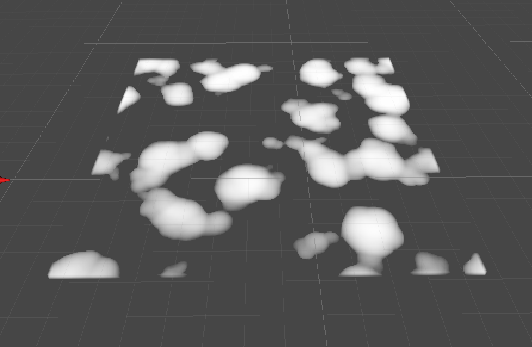
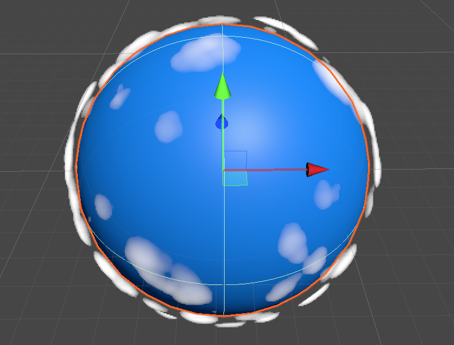
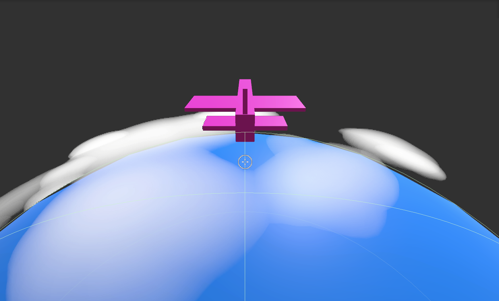

# MarchingCube in Unity
 Unity2020.3.22f1
 
 URP 10.7.0
 
 ray marching implementation cloud 
 refrence: 
 Real-time rendering of volumetric clouds 
 

| Scene | Image| | Description |
| --- | - | --- |--- |
| `cube box cloud` |  | | box cloud ||
| `sphere earth cloud` |  | | sphere cloud ||
| `earth height dependent` |  |  | 添加高度密度函数 ||
