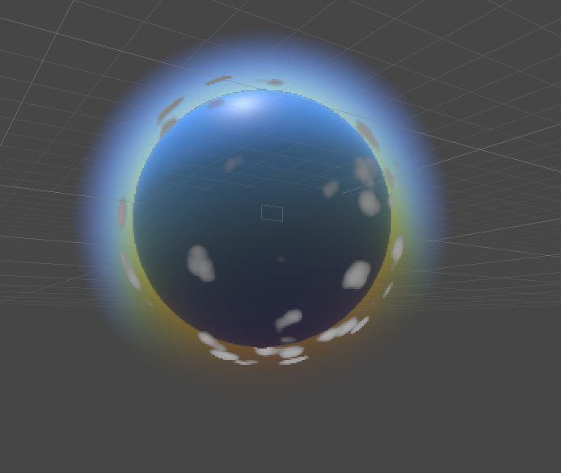
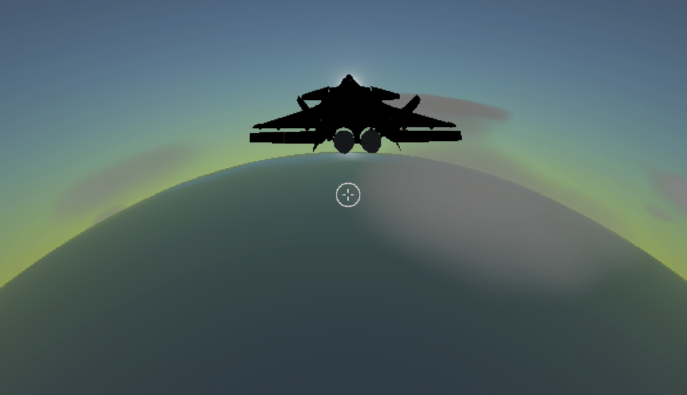

# MarchingCube in Unity
 Unity2020.3.22f1
 
 URP 10.7.0
 
 ray marching implementation cloud 
 Real-time rendering of volumetric clouds 
 

| Scene | Image| | Description |
| --- | - | --- |--- |
| `cube box cloud` |  | | box cloud ||
| `sphere earth cloud` |  | | sphere cloud ||
| `earth height dependent` |  |  | 添加高度密度函数 ||
| `earth sky and atomsphere` |  |  | 添加天空和大气层 ||

refrence: 
 
 https://omlc.org/classroom/ece532/class3/hg.html 
 https://github.com/Erkaman/glsl-worley 
 https://github.com/Ezharjan/NoiseShader 
 https://www.gamedev.net/forums/topic/680832-horizonzero-dawn-cloud-system/ 
 http://www.diva-portal.org/smash/get/diva2:1223894/FULLTEXT01.pdf 

 
